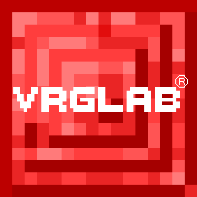

# Vrglab's Lib
 ![Minecraft: 1.19.2](https://img.shields.io/static/v1?label=&message=1.19.2&color=2d2d2d&labelColor=4e4e4e&style=flat-square&logo=data:image/png;base64,iVBORw0KGgoAAAANSUhEUgAAABAAAAAQCAYAAAAf8/9hAAAAAXNSR0IArs4c6QAAAARnQU1BAACxjwv8YQUAAAAJcEhZcwAADsMAAA7DAcdvqGQAAAAZdEVYdFNvZnR3YXJlAHBhaW50Lm5ldCA0LjAuMjCGJ1kDAAACoElEQVQ4T22SeU8aURTF/ULGtNRWWVQY9lXABWldIDPIMgVbNgEVtaa0damiqGBdipXaJcY2ofEf4ycbTt97pVAabzK5b27u+Z377kwXgK77QthRy7OfXbeJM+ttqKSXN8sdwbT/A0L7elmsYqrPHZmROLPh5YkV4oEBwaKuHj+yyJptLDoAhbq3O1V1XCVObY3FL24mfn5oRPrcwSCRfQOyNWcjVjZdCbtcdwcgXrXUspdOKbDN/XE9tiBJMhXHT60gUIT2dMhcDLMc3NVKQklz0QIkf5qlyEcO6Qs7yPhMJB4amDMFimQSmqNlE8SKAZFzDfxHfVILIIZ10sJ3OwIbcqSuiOjchkzNCboHev9o2YhgiUP8mxnLN24I6/3ghYdtQG5iUMpFBuCP9iKwLsfiLyeCp2rMnZgwX3NArGoxW1Ridl+BzLEVKa8KSxOqNmDdz0kFnxaLHhWEgAyZigWhHXL+pEDy2ozsDxv8vAzTnh7w5kcghqCaFmCT10of4iPIT2mRdPUh4HoCcVwBH/8Ac2kzUkEV5r3EfVSOvbAJa5NDyI0r2oDtWb1EClh+OoC3Pg7v/Bw7p939yI4rsRW2Y3lKh01eh7WpIRyKZqzyjjYgPdIvlaMWRqYuG7wWryYHsRM0sFolZiPvQ3jheIwSmSBPdkByG/B6Wi3RYiVmRX7GiAPiUCRisii8D+jZNKvPBrHCW1GY0bAz6WkDCtOaSyKQFsi4K5NqNiZtehN2Y5uAShETqolhBqJXpfdPuPsuWwAaRdHSkxdc11mPqkGnyY4pyKbpl1GyJ0Pel7yqBoFcF3zqno5f+d8ohYy9Sx7lzQpxo1eirluCDgt++00p6uxttrG4F/A39sJGZWZMfrcp6O6+5kaVzXJHAOj6DeSs8qw5o8oxAAAAAElFTkSuQmCC)
  

</img>

This is the remastered version of my very first Minecraft mod original made for minecraft 1.12

### Why ?
I was bored and the project was long overdue for an update
